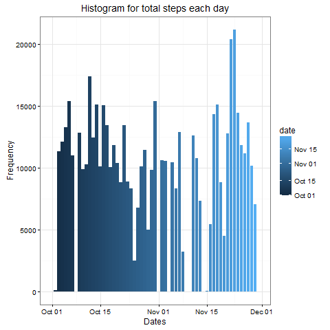
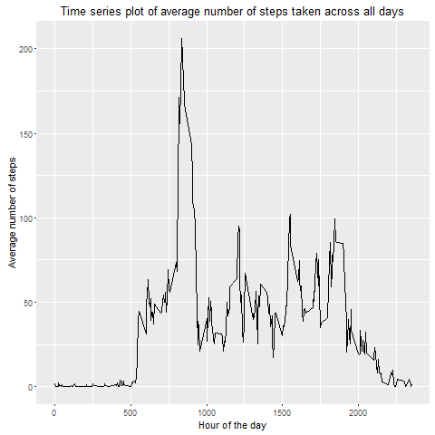
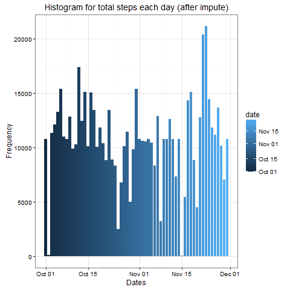
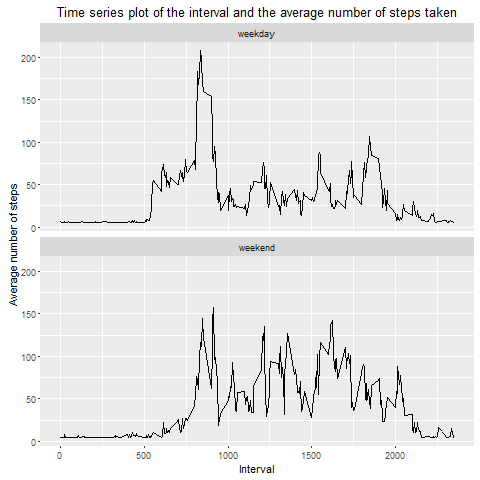

## Loading and preprocessing the data
Load the activity.csv file
``` 

# Initialize the data.table and ggplot2 package
library(data.table)
library(ggplot2)

# Read data from .csv file
if(!file.exists("./activity.csv")){
    print("Input file missing")          
}
activityData = read.csv("./activity.csv")

# Convert activityData to data table
actData <- data.table(activityData)
```


## What is mean total number of steps taken per day?
Mean is calcualted as shown below
```
# Total number of steps taken each day
actData_by_date <- as.data.frame(actData[, sum(steps, na.rm = TRUE),by = date])

# Format the date column
actData_by_date$date <- as.Date(actData_by_date$date,"%Y-%m-%d")

# Histogram of total number of steps taken each day
png(filename = "../repos/public/RepData_PeerAssessment1/figure/plot1.png",
width = 480, height = 480, units = "px", bg = "white")
ggplot(actData_by_date, aes(x=date, y=V1, fill=date))  + 
        geom_bar(stat="identity") +
        ylab("Frequency") + xlab("Dates") +
        labs(title="Histogram for total steps each day") +
         theme_bw()
dev.off()

#### Mean and median by date
actData_mean_by_date <- as.data.frame(actData[, mean(steps, na.rm = TRUE),
                                              by = date])
```



## What is the average daily activity pattern?
The average dailt pattern shows that the maximum number of steps walked are at 8:35 am on weekdays
```
# Average number of steps taken
actData_avg_by_interval <- as.data.frame(actData[, mean(steps, na.rm = TRUE),
                                              by = interval])
# Time series plot of average number of steps taken across all days
png(filename = "../repos/public/RepData_PeerAssessment1/figure/plot2.png",
width = 480, height = 480, units = "px", bg = "white")
ggplot(actData_avg_by_interval, aes(x=interval, y=V1)) + geom_line() +
        xlab("Hour of the day") + ylab("Average number of steps") +
        labs(title="Time series plot of average number of steps taken across all days") 
dev.off()


# 5-minute interval, on average across all the days in the dataset, contains the maximum number of steps
actData_avg_max_by_interval <- actData_avg_by_interval[actData_avg_by_interval$V1 == max(actData_avg_by_interval$V1),]

print(paste("On an Average people walk ",actData_avg_max_by_interval$V1, " steps at this time of the day : " , actData_avg_max_by_interval$interval));

```



## Imputing missing values
The strategy for imputing missing values was to replace NAs with the average value
```
# Total number of rows with NAs
rows_missing_data <- subset(actData,(is.na(actData$steps)))
print(paste("Total number of rows with missing data - ",nrow(rows_missing_data)));

# Strategy for filling in all of the missing values in the dataset
# Going to replace NAs with mean of the entire column

df <- actData
df$steps[is.na(df$steps)] = mean(df$steps, na.rm=TRUE)

# total number of steps taken each day (ater impute)
df_by_date <- as.data.frame(df[, sum(steps, na.rm = TRUE),by = date])

# Histogram of total number of steps taken each day (after impute)
df_by_date$date <- as.Date(df_by_date$date,"%Y-%m-%d")

png(filename = "../repos/public/RepData_PeerAssessment1/figure/plot3.png",
width = 480, height = 480, units = "px", bg = "white")
ggplot(df_by_date, aes(x=date, y=V1, fill=date))  + 
        geom_bar(stat="identity") +
        ylab("Frequency") + xlab("Dates") +
        labs(title="Histogram for total steps each day (after impute)") +
        theme_bw()
dev.off()


#### Mean and median by date
df_mean_by_date <- as.data.frame(df[, mean(steps, na.rm = TRUE),
                                              by = date])
# Merge two means to compare the values
compare_mean_by_date <- merge(df_mean_by_date,actData_mean_by_date, by = "date")
## > All the missing data has a mean value, histogram is more complete now

```



## Are there differences in activity patterns between weekdays and weekends?
The difference in the activity patters is clearly visible in the time series plot.
```
df_weekday <- df
df_weekday$date <- as.Date(df_weekday$date,"%Y-%m-%d")
df_weekday$day=weekdays(df_weekday$date)
df_weekday$wend <- as.factor(ifelse(weekdays(df_weekday$date) %in% c("Saturday","Sunday"), "Weekend", "Weekday")) 

#  Seperate Weekdays from weekends
df_all_weekdays <- subset(df_weekday, df_weekday$wend == "Weekday")
df_all_weekends <- subset(df_weekday, df_weekday$wend == "Weekend")

#  average number of steps taken (after impute)
df_avg_all_weekdays_by_interval <- as.data.frame(df_all_weekdays[, mean(steps, na.rm = TRUE),
                                                 by = interval])
df_avg_all_weekends_by_interval <- as.data.frame(df_all_weekends[, mean(steps, na.rm = TRUE),
                                                                 by = interval])

df_avg_all_weekdays_by_interval$day <- "weekday"
df_avg_all_weekends_by_interval$day <- "weekend"
df_avg_all_days_by_interval <- rbind(df_avg_all_weekdays_by_interval, df_avg_all_weekends_by_interval)
        
        
# Time series plot of the interval and the average number of steps taken, 
# averaged across all weekday days or weekend days
png(filename = "../repos/public/RepData_PeerAssessment1/figure/plot4.png",
width = 480, height = 480, units = "px", bg = "white")
ggplot(df_avg_all_days_by_interval, aes(x=interval, y=V1)) + geom_line() +
        xlab("Interval") + ylab("Average number of steps") +
        labs(title="Time series plot of the interval and the average number of steps taken") +
        facet_wrap(~ day, ncol = 1)
dev.off()        
```

